# Zrzuty — PR #169 · scenariusze-za-logowaniem

Przebieg [`31812917168`](https://github.com/fpudelko/bojo-app/actions/runs/31812917168)
 · [wróć do PR-a](https://github.com/fpudelko/bojo-app/pull/169)

Zmienione widoki: **0** · nowe widoki: **40**

Raport kasuje się sam po 7 dniach.

## Nowe widoki

Nie było ich wcześniej, więc nie ma z czym porównywać —
to jest po prostu to, co widzi użytkownik.

### scenariusze-komputer · bramkarze-rezerwacja-licznik

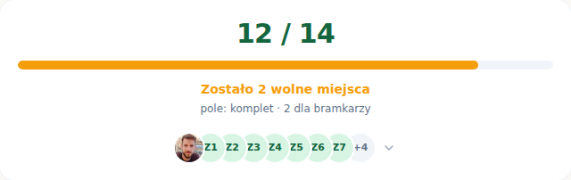

### scenariusze-komputer · bramkarze-rezerwacja-okno

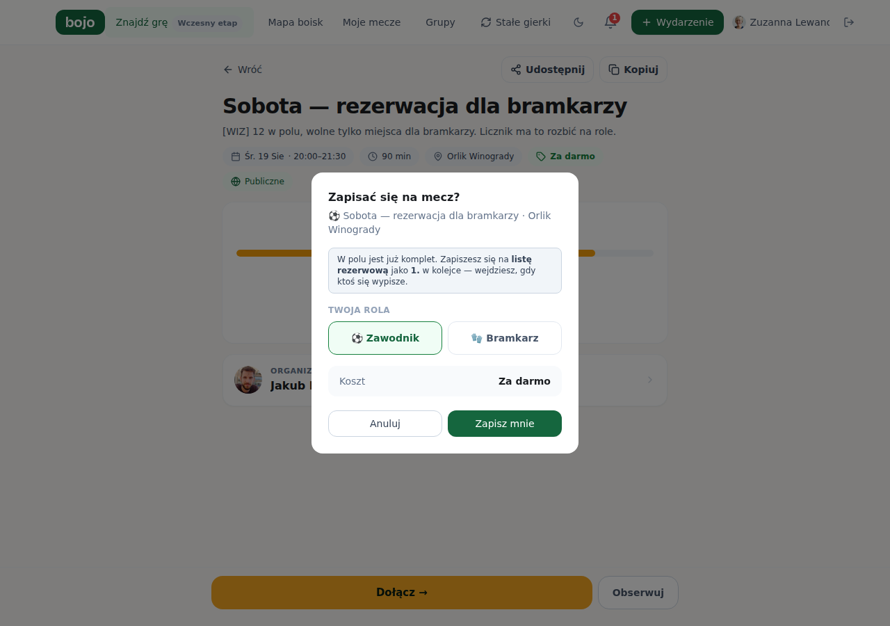

### scenariusze-komputer · bramkarze-wspolna-licznik

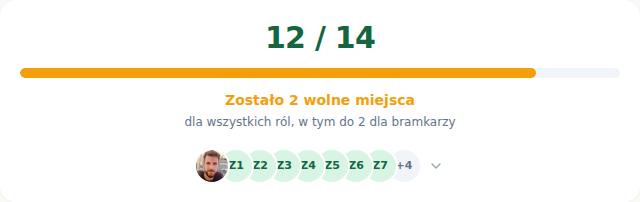

### scenariusze-komputer · grupa-nowa-formularz

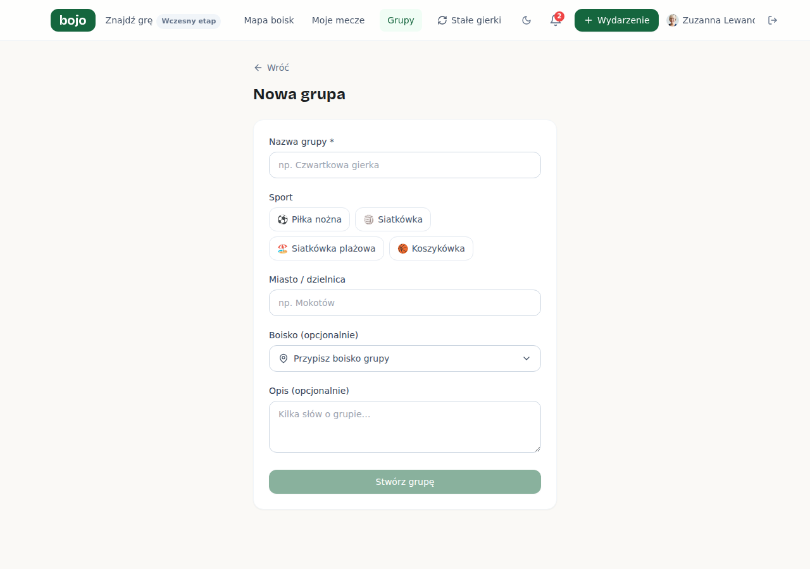

### scenariusze-komputer · grupy-pusto

### scenariusze-komputer · grupy-zly-kod

### scenariusze-komputer · karta-rezerwy

### scenariusze-komputer · kolejka-organizator

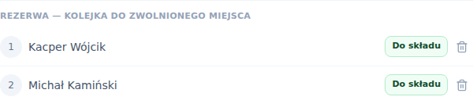

### scenariusze-komputer · kreator-krok-1

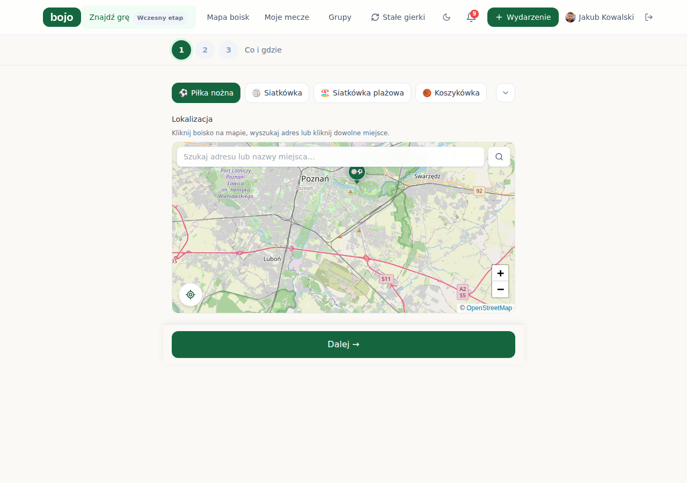

### scenariusze-komputer · licznik-po-dolaczeniu

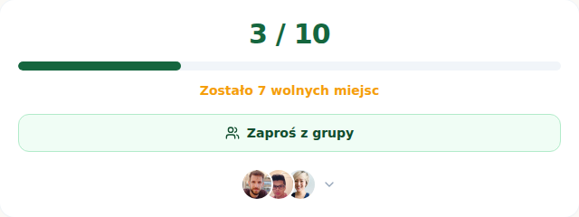

### scenariusze-komputer · licznik-przed-dolaczeniem

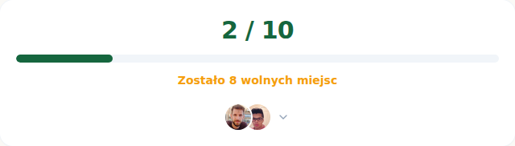

### scenariusze-komputer · moje-gry-historia-pusto

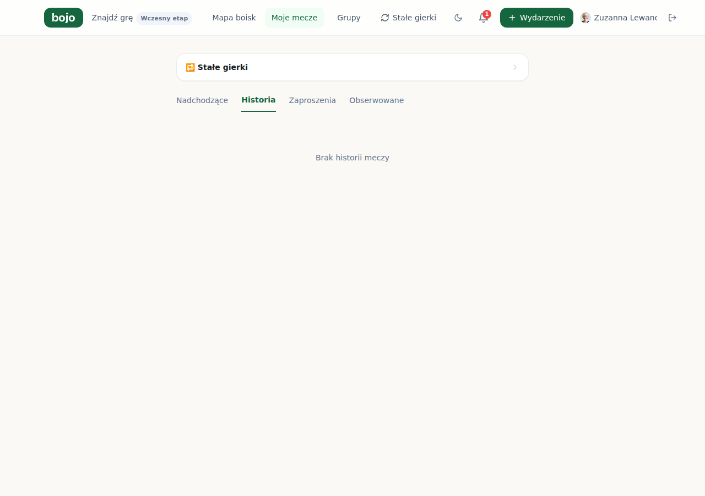

### scenariusze-komputer · moje-gry-zakladki

### scenariusze-komputer · moje-gry-zaproszenia-pusto

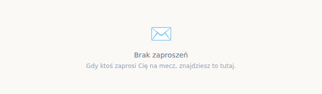

### scenariusze-komputer · oczekuje-na-akceptacje

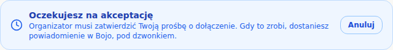

### scenariusze-komputer · okno-filtrow

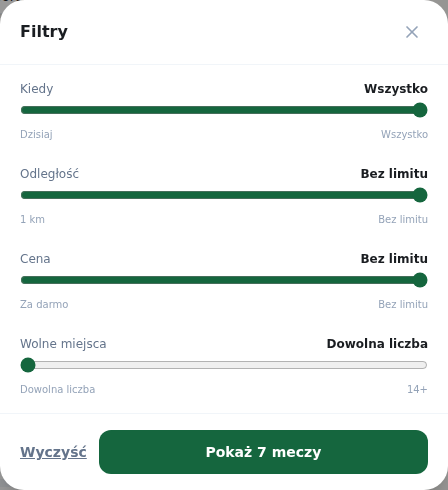

### scenariusze-komputer · okno-platnosci

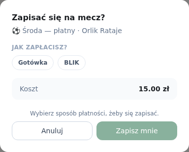

### scenariusze-komputer · panel-powiadomien

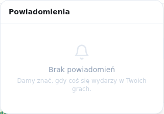

### scenariusze-komputer · profil

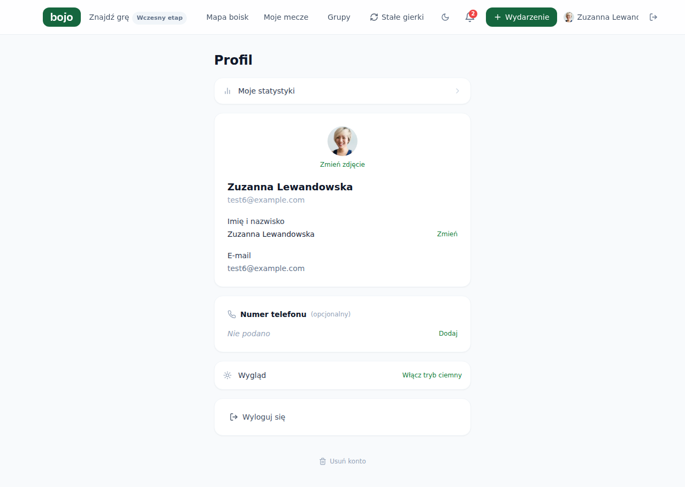

### scenariusze-komputer · prosby-organizator

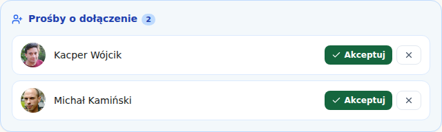

### scenariusze-telefon · bramkarze-rezerwacja-licznik

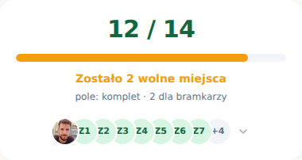

### scenariusze-telefon · bramkarze-rezerwacja-okno

### scenariusze-telefon · bramkarze-wspolna-licznik

### scenariusze-telefon · grupa-nowa-formularz

### scenariusze-telefon · grupy-pusto

### scenariusze-telefon · grupy-zly-kod

### scenariusze-telefon · karta-rezerwy

### scenariusze-telefon · kolejka-organizator

### scenariusze-telefon · kreator-krok-1

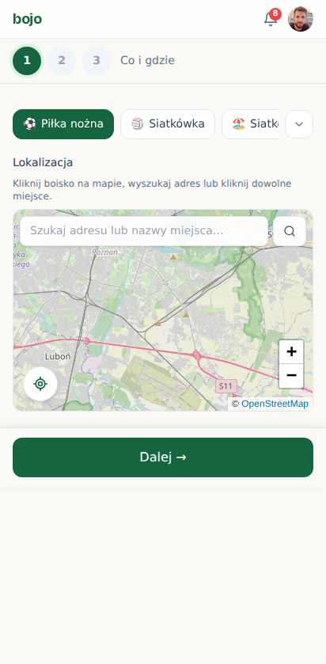

### scenariusze-telefon · licznik-po-dolaczeniu

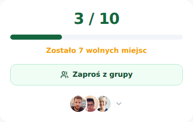

### scenariusze-telefon · licznik-przed-dolaczeniem

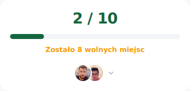

### scenariusze-telefon · moje-gry-historia-pusto

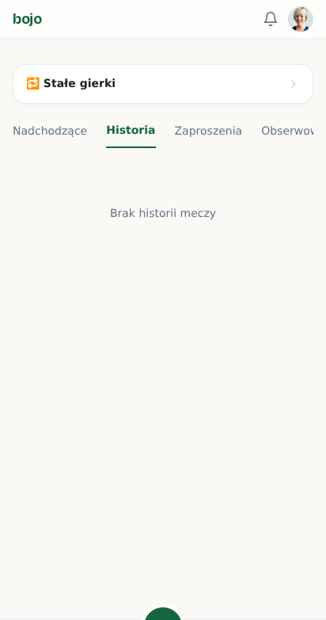

### scenariusze-telefon · moje-gry-zakladki

### scenariusze-telefon · moje-gry-zaproszenia-pusto

### scenariusze-telefon · oczekuje-na-akceptacje

### scenariusze-telefon · okno-filtrow

### scenariusze-telefon · okno-platnosci

### scenariusze-telefon · panel-powiadomien

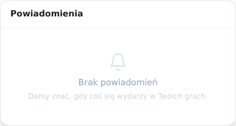

### scenariusze-telefon · profil

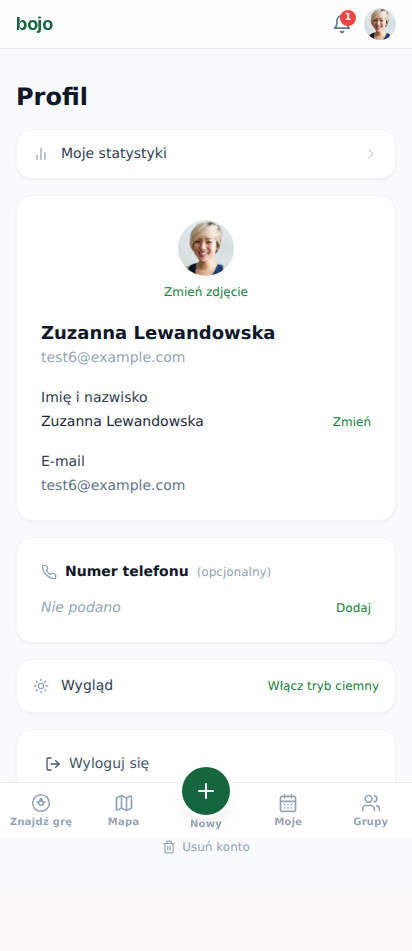

### scenariusze-telefon · prosby-organizator

