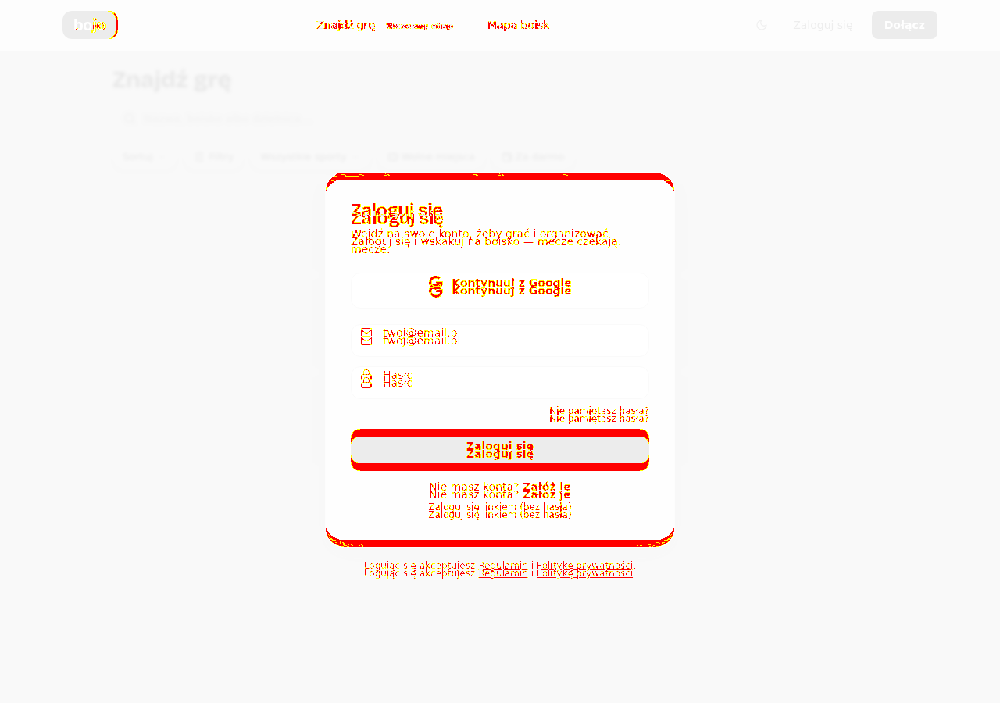
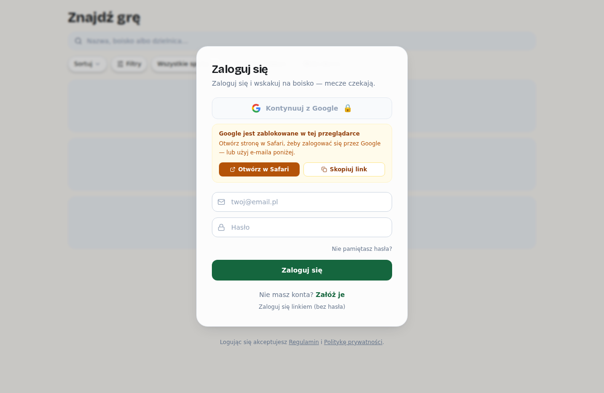
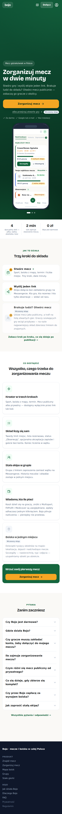
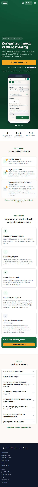
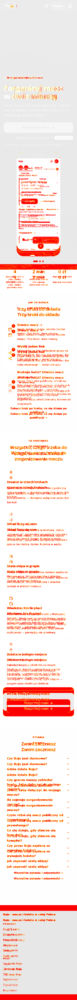

# Zrzuty — PR #172 · widoki-publiczne

Przebieg [`31816749551`](https://github.com/fpudelko/bojo-app/actions/runs/31816749551)
 · [wróć do PR-a](https://github.com/fpudelko/bojo-app/pull/172)

Zmienione widoki: **3** · nowe widoki: **0**

Raport kasuje się sam po 7 dniach.

## Zmienione widoki

Kolejno: **wzorzec** (jak było), **teraz** (jak jest), **różnica**
(podświetlone piksele, które się ruszyły).

### logowanie

**wzorzec**

**teraz**

**różnica**

### logowanie-webview-facebook

**wzorzec**

**teraz**

**różnica**

### strona-glowna

**wzorzec**

**teraz**

**różnica**

