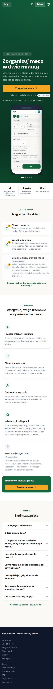
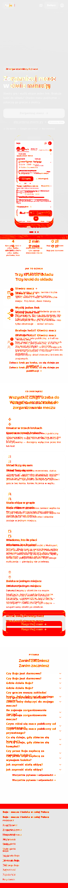
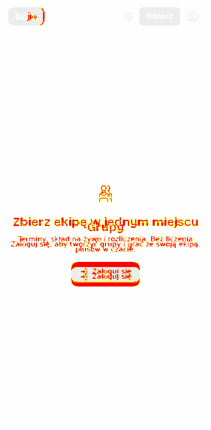

# Zrzuty — PR #177 · widoki-publiczne

Przebieg [`31873169954`](https://github.com/fpudelko/bojo-app/actions/runs/31873169954)
 · [wróć do PR-a](https://github.com/fpudelko/bojo-app/pull/177)

Zmienione widoki: **2** · nowe widoki: **0**

Raport kasuje się sam po 7 dniach.

## Zmienione widoki

Kolejno: **wzorzec** (jak było), **teraz** (jak jest), **różnica**
(podświetlone piksele, które się ruszyły).

### strona-glowna

**wzorzec**

**teraz**

**różnica**

### wylogowany-grupy

**wzorzec**

**teraz**

**różnica**

