# Zrzuty — PR #228 · widoki-publiczne

Przebieg [`32344029644`](https://github.com/fpudelko/bojo-app/actions/runs/32344029644)
 · [wróć do PR-a](https://github.com/fpudelko/bojo-app/pull/228)

Zmienione widoki: **7** · nowe widoki: **0**

Raport kasuje się sam po 7 dniach.

## Zmienione widoki

Dla każdego widoku: najpierw **wycinek** samego zmienionego miejsca
w czytelnej skali, potem całe strony obok siebie.

### trasa-dlaczego-bojo

<table><tr>
<td width="50%" align="center"><b>było</b> 
</td>
<td width="50%" align="center"><b>jest</b> 
</td>
</tr></table>

<table><tr>
<td width="50%" align="center"><b>cała strona — było</b> 
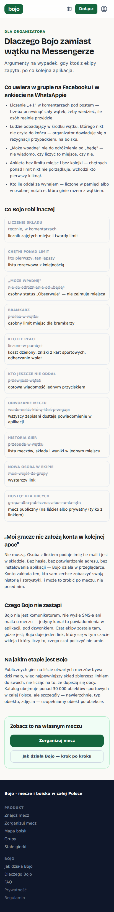</td>
<td width="50%" align="center"><b>cała strona — jest</b> 
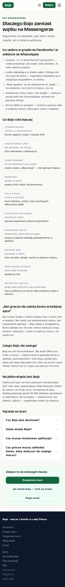</td>
</tr></table>

nakładka z podświetlonymi pikselami

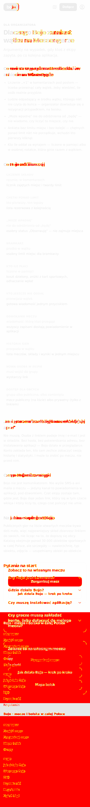

### trasa-grupy

<table><tr>
<td width="50%" align="center"><b>było</b> 
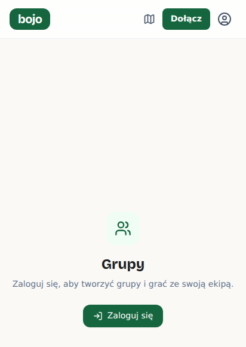</td>
<td width="50%" align="center"><b>jest</b> 
</td>
</tr></table>

<table><tr>
<td width="50%" align="center"><b>cała strona — było</b> 
</td>
<td width="50%" align="center"><b>cała strona — jest</b> 
</td>
</tr></table>

nakładka z podświetlonymi pikselami

### trasa-jak-dziala-bojo

<table><tr>
<td width="50%" align="center"><b>było</b> 
</td>
<td width="50%" align="center"><b>jest</b> 
</td>
</tr></table>

<table><tr>
<td width="50%" align="center"><b>cała strona — było</b> 
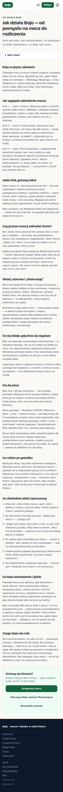</td>
<td width="50%" align="center"><b>cała strona — jest</b> 
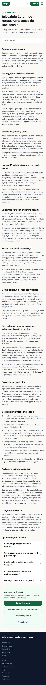</td>
</tr></table>

nakładka z podświetlonymi pikselami

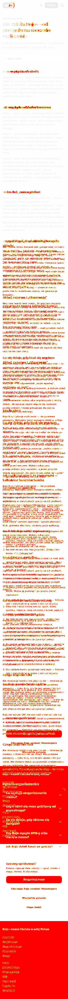

### trasa-strona-glowna

<table><tr>
<td width="50%" align="center"><b>było</b> 
</td>
<td width="50%" align="center"><b>jest</b> 
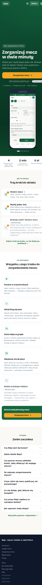</td>
</tr></table>

<table><tr>
<td width="50%" align="center"><b>cała strona — było</b> 
</td>
<td width="50%" align="center"><b>cała strona — jest</b> 
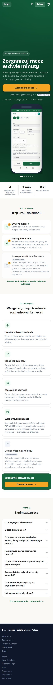</td>
</tr></table>

nakładka z podświetlonymi pikselami

### wylogowany-grupy

<table><tr>
<td width="50%" align="center"><b>było</b> 
</td>
<td width="50%" align="center"><b>jest</b> 
</td>
</tr></table>

<table><tr>
<td width="50%" align="center"><b>cała strona — było</b> 
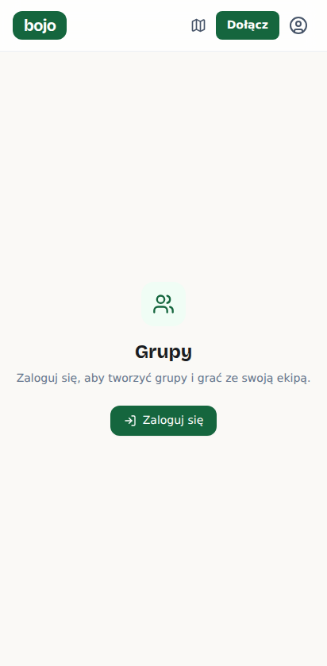</td>
<td width="50%" align="center"><b>cała strona — jest</b> 
</td>
</tr></table>

nakładka z podświetlonymi pikselami

### zacheta-instalacji-android

<table><tr>
<td width="50%" align="center"><b>było</b> 
</td>
<td width="50%" align="center"><b>jest</b> 
</td>
</tr></table>

<table><tr>
<td width="50%" align="center"><b>cała strona — było</b> 
</td>
<td width="50%" align="center"><b>cała strona — jest</b> 
</td>
</tr></table>

nakładka z podświetlonymi pikselami

### zacheta-instalacji-ios

<table><tr>
<td width="50%" align="center"><b>było</b> 
</td>
<td width="50%" align="center"><b>jest</b> 
</td>
</tr></table>

<table><tr>
<td width="50%" align="center"><b>cała strona — było</b> 
</td>
<td width="50%" align="center"><b>cała strona — jest</b> 
</td>
</tr></table>

nakładka z podświetlonymi pikselami

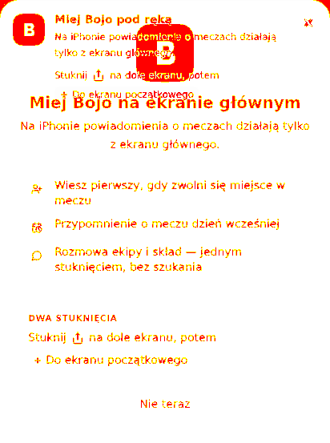

