# Zrzuty — PR #249 · widoki-publiczne

Przebieg [`32596179066`](https://github.com/fpudelko/bojo-app/actions/runs/32596179066)
 · [wróć do PR-a](https://github.com/fpudelko/bojo-app/pull/249)

Zmienione widoki: **15** · nowe widoki: **4**

Raport kasuje się sam po 7 dniach.

## Zmienione widoki

Dla każdego widoku: najpierw **wycinek** samego zmienionego miejsca
w czytelnej skali, potem całe strony obok siebie.

### logowanie

<table><tr>
<td width="50%" align="center"><b>było</b> 
</td>
<td width="50%" align="center"><b>jest</b> 
</td>
</tr></table>

<table><tr>
<td width="50%" align="center"><b>cała strona — było</b> 
</td>
<td width="50%" align="center"><b>cała strona — jest</b> 
</td>
</tr></table>

nakładka z podświetlonymi pikselami

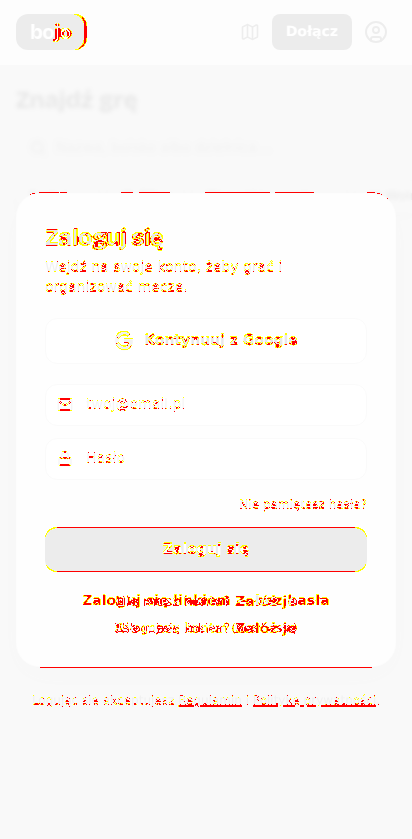

### logowanie-limit-prob

<table><tr>
<td width="50%" align="center"><b>było</b> 
</td>
<td width="50%" align="center"><b>jest</b> 
</td>
</tr></table>

<table><tr>
<td width="50%" align="center"><b>cała strona — było</b> 
</td>
<td width="50%" align="center"><b>cała strona — jest</b> 
</td>
</tr></table>

nakładka z podświetlonymi pikselami

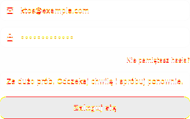

### logowanie-mail-niepotwierdzony

<table><tr>
<td width="50%" align="center"><b>było</b> 
</td>
<td width="50%" align="center"><b>jest</b> 
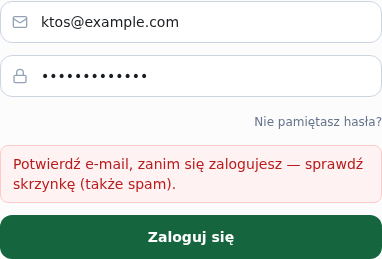</td>
</tr></table>

<table><tr>
<td width="50%" align="center"><b>cała strona — było</b> 
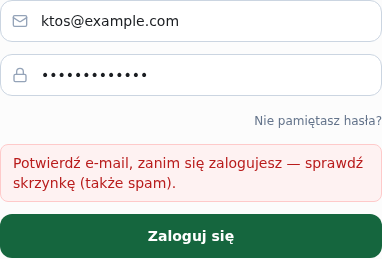</td>
<td width="50%" align="center"><b>cała strona — jest</b> 
</td>
</tr></table>

nakładka z podświetlonymi pikselami

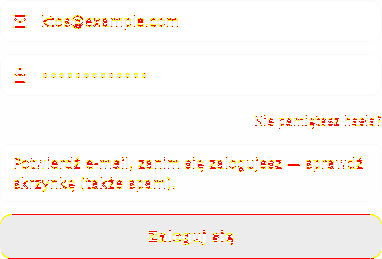

### logowanie-webview-facebook

<table><tr>
<td width="50%" align="center"><b>było</b> 
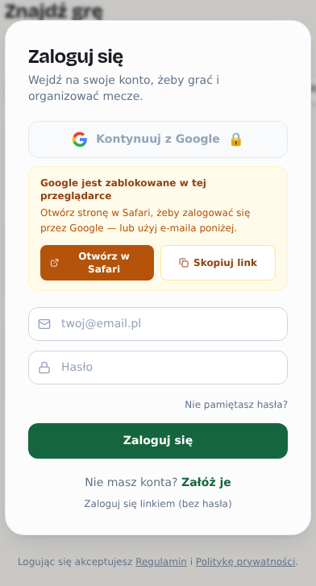</td>
<td width="50%" align="center"><b>jest</b> 
</td>
</tr></table>

<table><tr>
<td width="50%" align="center"><b>cała strona — było</b> 
</td>
<td width="50%" align="center"><b>cała strona — jest</b> 
</td>
</tr></table>

nakładka z podświetlonymi pikselami

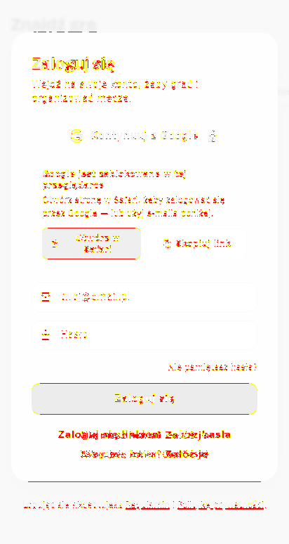

### logowanie-zle-haslo

<table><tr>
<td width="50%" align="center"><b>było</b> 
</td>
<td width="50%" align="center"><b>jest</b> 
</td>
</tr></table>

<table><tr>
<td width="50%" align="center"><b>cała strona — było</b> 
</td>
<td width="50%" align="center"><b>cała strona — jest</b> 
</td>
</tr></table>

nakładka z podświetlonymi pikselami

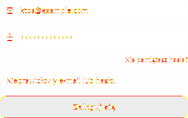

### trasa-dlaczego-bojo

<table><tr>
<td width="50%" align="center"><b>było</b> 
</td>
<td width="50%" align="center"><b>jest</b> 
</td>
</tr></table>

<table><tr>
<td width="50%" align="center"><b>cała strona — było</b> 
</td>
<td width="50%" align="center"><b>cała strona — jest</b> 
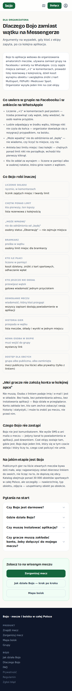</td>
</tr></table>

nakładka z podświetlonymi pikselami

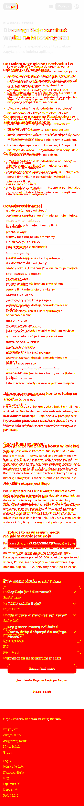

### trasa-faq

<table><tr>
<td width="50%" align="center"><b>było</b> 
</td>
<td width="50%" align="center"><b>jest</b> 
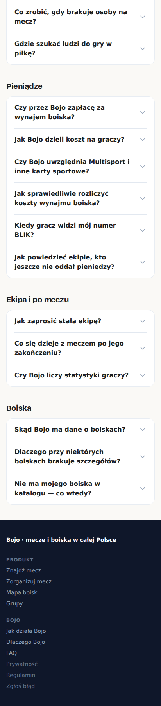</td>
</tr></table>

<table><tr>
<td width="50%" align="center"><b>cała strona — było</b> 
</td>
<td width="50%" align="center"><b>cała strona — jest</b> 
</td>
</tr></table>

nakładka z podświetlonymi pikselami

### trasa-grupy

<table><tr>
<td width="50%" align="center"><b>było</b> 
</td>
<td width="50%" align="center"><b>jest</b> 
</td>
</tr></table>

<table><tr>
<td width="50%" align="center"><b>cała strona — było</b> 
</td>
<td width="50%" align="center"><b>cała strona — jest</b> 
</td>
</tr></table>

nakładka z podświetlonymi pikselami

### trasa-grupy-nowe

<table><tr>
<td width="50%" align="center"><b>było</b> 
</td>
<td width="50%" align="center"><b>jest</b> 
</td>
</tr></table>

<table><tr>
<td width="50%" align="center"><b>cała strona — było</b> 
</td>
<td width="50%" align="center"><b>cała strona — jest</b> 
</td>
</tr></table>

nakładka z podświetlonymi pikselami

### trasa-jak-dziala-bojo

<table><tr>
<td width="50%" align="center"><b>było</b> 
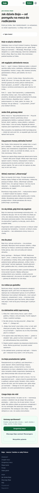</td>
<td width="50%" align="center"><b>jest</b> 
</td>
</tr></table>

<table><tr>
<td width="50%" align="center"><b>cała strona — było</b> 
</td>
<td width="50%" align="center"><b>cała strona — jest</b> 
</td>
</tr></table>

nakładka z podświetlonymi pikselami

### trasa-logowanie

<table><tr>
<td width="50%" align="center"><b>było</b> 
</td>
<td width="50%" align="center"><b>jest</b> 
</td>
</tr></table>

<table><tr>
<td width="50%" align="center"><b>cała strona — było</b> 
</td>
<td width="50%" align="center"><b>cała strona — jest</b> 
</td>
</tr></table>

nakładka z podświetlonymi pikselami

### trasa-strona-glowna

<table><tr>
<td width="50%" align="center"><b>było</b> 
</td>
<td width="50%" align="center"><b>jest</b> 
</td>
</tr></table>

<table><tr>
<td width="50%" align="center"><b>cała strona — było</b> 
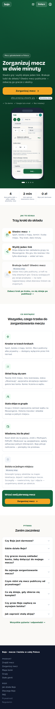</td>
<td width="50%" align="center"><b>cała strona — jest</b> 
</td>
</tr></table>

nakładka z podświetlonymi pikselami

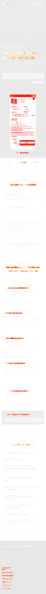

### wylogowany-grupy

<table><tr>
<td width="50%" align="center"><b>było</b> 
</td>
<td width="50%" align="center"><b>jest</b> 
</td>
</tr></table>

<table><tr>
<td width="50%" align="center"><b>cała strona — było</b> 
</td>
<td width="50%" align="center"><b>cała strona — jest</b> 
</td>
</tr></table>

nakładka z podświetlonymi pikselami

### zacheta-instalacji-android

<table><tr>
<td width="50%" align="center"><b>było</b> 
</td>
<td width="50%" align="center"><b>jest</b> 
</td>
</tr></table>

<table><tr>
<td width="50%" align="center"><b>cała strona — było</b> 
</td>
<td width="50%" align="center"><b>cała strona — jest</b> 
</td>
</tr></table>

nakładka z podświetlonymi pikselami

### zacheta-instalacji-ios

<table><tr>
<td width="50%" align="center"><b>było</b> 
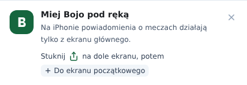</td>
<td width="50%" align="center"><b>jest</b> 
</td>
</tr></table>

<table><tr>
<td width="50%" align="center"><b>cała strona — było</b> 
</td>
<td width="50%" align="center"><b>cała strona — jest</b> 
</td>
</tr></table>

nakładka z podświetlonymi pikselami

## Nowe widoki

Nie było ich wcześniej, więc nie ma z czym porównywać —
to jest po prostu to, co widzi użytkownik.

### zrzuty-komputer · trasa-sport-miasto-poznan

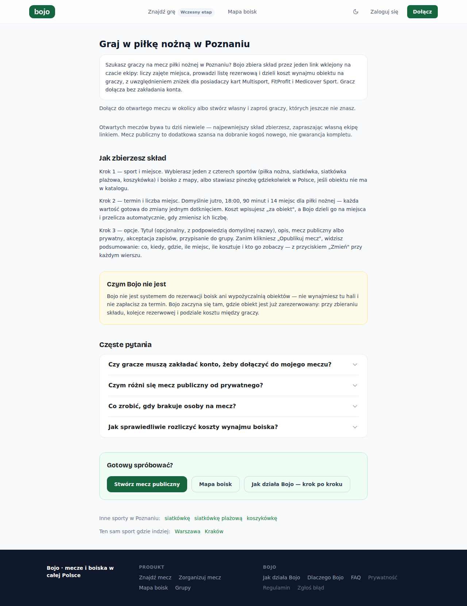

### zrzuty-komputer · trasa-sport-miasto-warszawa

### zrzuty-telefon · trasa-sport-miasto-poznan

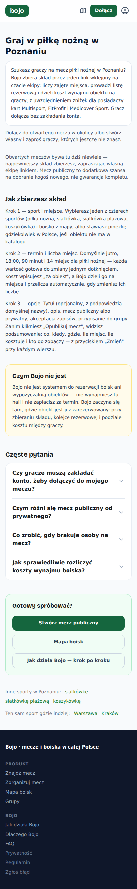

### zrzuty-telefon · trasa-sport-miasto-warszawa

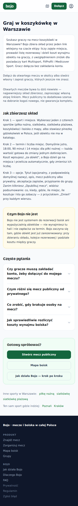

