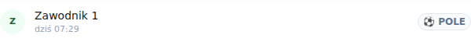
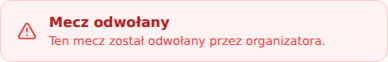

# Zrzuty — PR #288 · scenariusze-za-logowaniem

Przebieg [`33049755125`](https://github.com/fpudelko/bojo-app/actions/runs/33049755125)
 · [wróć do PR-a](https://github.com/fpudelko/bojo-app/pull/288)

Zmienione widoki: **0** · nowe widoki: **5**

Raport kasuje się sam po 7 dniach.

## Nowe widoki

Nie było ich wcześniej, więc nie ma z czym porównywać —
to jest po prostu to, co widzi użytkownik.

### scenariusze-komputer · mecz-odwolany-baner

### scenariusze-komputer · sklad-oznaczenie-pola

### scenariusze-telefon · mecz-odwolany-baner

### scenariusze-telefon · okno-wypisania-telefon

### scenariusze-telefon · sklad-oznaczenie-pola

