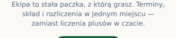
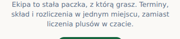
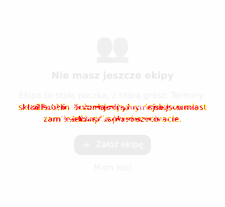

# Zrzuty — PR #405 · scenariusze-za-logowaniem

Przebieg [`35510509359`](https://github.com/fpudelko/bojo-app/actions/runs/35510509359)
 · [wróć do PR-a](https://github.com/fpudelko/bojo-app/pull/405)

Zmienione widoki: **1** · nowe widoki: **0**

Raport kasuje się sam po 7 dniach.

## Zmienione widoki

Dla każdego widoku: najpierw **wycinek** samego zmienionego miejsca
w czytelnej skali, potem całe strony obok siebie.

### grupy-pusto

<table><tr>
<td width="50%" align="center"><b>było</b> 
</td>
<td width="50%" align="center"><b>jest</b> 
</td>
</tr></table>

<table><tr>
<td width="50%" align="center"><b>cała strona — było</b> 
</td>
<td width="50%" align="center"><b>cała strona — jest</b> 
</td>
</tr></table>

nakładka z podświetlonymi pikselami

